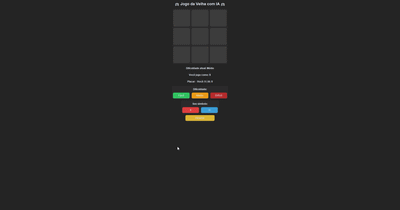

# 🎮 Jogo da Velha com IA

Um jogo da velha moderno feito em **Python** com **CustomTkinter** para interface gráfica e uma **IA adversária** com três níveis de dificuldade.

## ✨ Funcionalidades
- 🧠 **IA com 3 níveis de dificuldade**:
  - Fácil → jogadas aleatórias
  - Médio → bloqueia jogadas do jogador
  - Difícil → algoritmo Minimax (quase impossível de vencer)
- 🔀 **Escolha entre X ou O**
- 🏆 **Placar automático** (você vs IA)
- 🌟 **Interface moderna** com CustomTkinter (dark mode)
- ✅ **Destaque visual da linha vencedora**

## 🎥 Demonstração


## 🚀 Como rodar
1. Clone este repositório:
   ```bash
   git clone https://github.com/Jos3Vitor34/jogo-da-velha.git

2. Entre na pasta do projeto:
cd jogo-da-velha

3. Instale as dependências:
pip install customtkinter

4. Execute o jogo:
python main.py

🛠 Tecnologias usadas

- Python
- CustomTkinter

📄 Licença
Este projeto está sob a licença MIT. Sinta-se livre para usar e modificar.